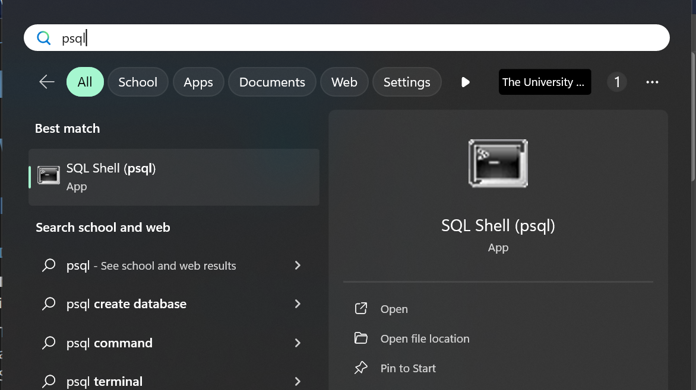

# For Window
## Clone the project
## Setup Java SDK
* Download and install Java SDK (https://corretto.aws/downloads/latest/amazon-corretto-17-x64-windows-jdk.msi)
* Add the path of the bin directory of the installed SDK to the <strong><i>Path</i></strong> variable of System variables (Environment variables)

## Setup Gradle
Download and install Gradle v7.6.2 (https://gradle.org/next-steps/?version=7.6.2&format=all)
Add the bin directory of the installed Gradle to the <strong><i>Path</i></strong> variable of System variables (Environment variables)

## Setup Postgresql
* Download and Install Postgresql v15.3 (or any 15.x version) - (https://sbp.enterprisedb.com/getfile.jsp?fileid=1258649)
* Choose PSQL, Postgresql Server and Pgadmin 4 when installing
### Run the following script using PSQL

```
CREATE DATABASE colphacy; 
\c colphacy; 
CREATE USER colphacy WITH PASSWORD 'colphacy'; 
GRANT ALL PRIVILEGES ON DATABASE colphacy TO colphacy; 

GRANT USAGE, CREATE ON SCHEMA public TO colphacy; 
ALTER DEFAULT PRIVILEGES IN SCHEMA public 
GRANT SELECT, INSERT, UPDATE, DELETE ON TABLES TO colphacy; 
ALTER DEFAULT PRIVILEGES IN SCHEMA public 
GRANT USAGE, SELECT ON SEQUENCES TO colphacy;
```
## Run the project
* Cd to the project directory
* Enter the command 
```gradle bootRun```
* Navigate to the link <a href="http://localhost:8080/api/products">Product API</a> to see if it works
